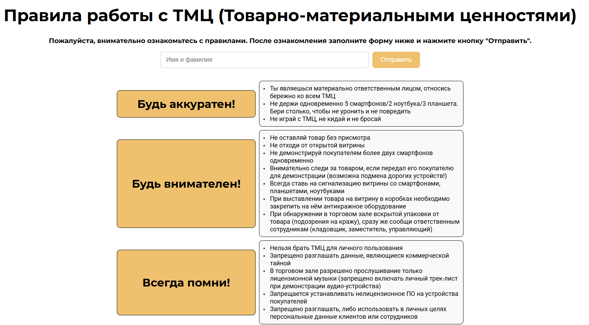
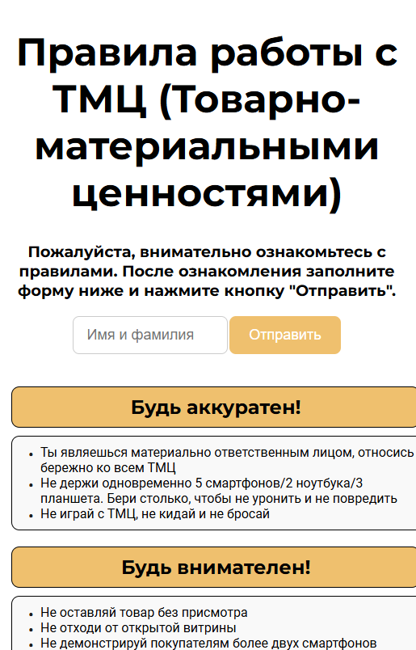
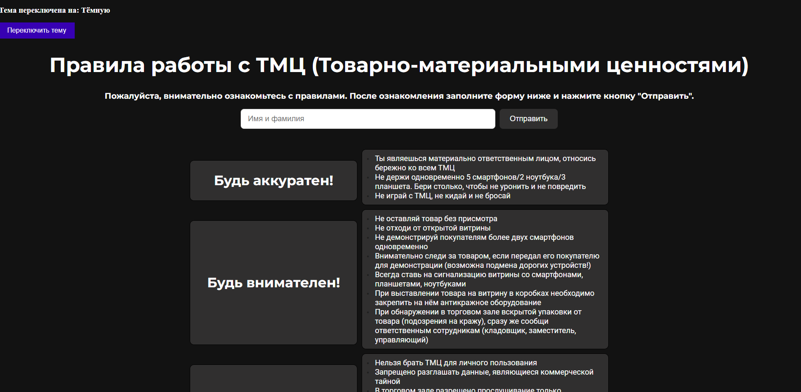

## Документация по проекту "Правила работы с ТМЦ (Employee-Handbook)"

Этот проект представляет собой **памятку для сотрудников магазина электронной техники**, в которой изложены основные **правила работы с товаром, который представляет материальную ценность**. Памятка предназначена для того, чтобы помочь сотрудникам эффективно и безопасно работать с товарами, предотвращать возможные ошибки и обеспечивать сохранность продукции.

## Стек технологий

- **TypeScript**
- **React**
- **HTML**
- **CSS**
- **Flexbox**
- **Grid layout**
- **Media queries**

## Интерфейс для десктопной версии приложения.



Чтобы запустить проект на своем локальном компьютере, выполните следующие шаги:

1. Откройте командную строку (или терминал).

2. Клонируйте репозиторий:

   ```bash
   git clone https://github.com/Aleksandr64ru/Employee-Handbook.git

3. Перейдите в директорию проекта:
   
   ```bash
   cd ваш диск:\ваша папка\Employee-Handbook\employee

4. Установите зависимости:

    ```
   npm install
    ```

5. Запустите приложение:

   ```
   npm start
   ```

## Компонент App: 
Компонент App является основным компонентом приложения, который управляет состоянием ввода данных, отображает форму для ввода имени и фамилии пользователя и выводит соответствующие уведомления при отправке формы. Он также включает два вспомогательных компонента: Title (заголовок) и Rules (правила).

Основные функции компонента:
Состояние inputValue:

Используется хук состояния useState для хранения значения, введенного пользователем в поле ввода.
Состояние обновляется при каждом изменении значения в поле ввода с помощью функции handleChange.
Обработчик изменений handleChange:

Обрабатывает изменение значения в поле ввода.
Обновляет состояние inputValue, чтобы отобразить текущее значение в поле ввода.
Обработчик отправки формы handleSubmit:

Выполняется при отправке формы.
Предотвращает перезагрузку страницы с помощью event.preventDefault().
Проверяет, не пустое ли значение в поле ввода. Если поле пустое, выводится предупреждение "Пожалуйста, введите имя и фамилию." Если значение введено, появляется алерт с текстом "Отправлено: {введенное имя и фамилия}".
Отображение компонентов:

Компонент Title используется для отображения заголовка в верхней части страницы.
Компонент CustomInput представляет собой поле ввода, в которое пользователь может ввести свои данные (имя и фамилию).
Компонент Rules отображает правила или дополнительную информацию в нижней части страницы.
Кнопка "Отправить":

Кнопка отправки формы, при нажатии на которую происходит вызов обработчика handleSubmit.


## Компонент CustomInput:

CustomInput — это компонент, который представляет собой настраиваемое поле ввода с динамическим изменением текста подсказки в зависимости от фокуса на поле. Когда поле получает фокус, текст подсказки меняется, и возвращается к исходному тексту при потере фокуса.

Основные особенности компонента:
Состояние inputPlaceholder:

Хук useState используется для хранения текущего значения текста подсказки. Изначально значение подсказки устанавливается через проп placeholder, переданный в компонент.
Обработчики событий:

handleFocus: Этот обработчик изменяет текст подсказки на "Введити Фамилию и имя..." при фокусе на поле ввода.
handleBlur: Этот обработчик восстанавливает исходный текст подсказки (значение placeholder), когда поле ввода теряет фокус.
Рендеринг JSX:

Компонент рендерит элемент <input>, в который передаются следующие пропсы:
```bash
className="custom-input" — для применения стилей из файла CSS.
placeholder={inputPlaceholder} — отображаемый текст подсказки, который изменяется при фокусе.
value={value} — значение поля ввода, передаваемое из родительского компонента.
onChange={onChange} — обработчик изменений в поле ввода, передаваемый из родительского компонента.
onFocus={handleFocus} — обработчик фокуса на поле ввода.
onBlur={handleBlur} — обработчик потери фокуса на поле ввода.
```

Пример использования компонента:

```bash
interface CustomInputProps {
  placeholder?: string; // placeholder — строка, может быть необязательным
  value: string; // value — строка (обязательное поле)
  onChange: (event: React.ChangeEvent<HTMLInputElement>) => void; // onChange — функция для обработки изменения значения input
}

const CustomInput: React.FC<CustomInputProps> = ({ placeholder = "Фамилия и Имя", value, onChange }) => {
  const [inputPlaceholder, setInputPlaceholder] = useState<string>(placeholder);
```

## Компонент Rules:
  
  Компонент Rules представляет собой список правил для сотрудников, разделенный на несколько секций. Каждая секция содержит заголовок и перечень пунктов, которые необходимо соблюдать.

Основные особенности компонента:
Массив данных rulesData:

Массив объектов, каждый из которых представляет собой одну секцию правил. Каждая секция содержит:
title — заголовок секции (например, "Будь аккуратен!").
items — массив строк, каждая из которых является пунктом правила в данной секции.
Метод map для рендеринга данных:

Компонент использует метод map для перебора массива rulesData и создания для каждого объекта отдельной секции (article).
Для каждой секции создается заголовок (h2), а затем список (ul) с правилами (li).
HTML структура:

Каждый элемент списка (правило) внутри секции отображается в виде <li>.
Вся структура секции обернута в <article>, что помогает семантически разделить различные группы правил.
CSS стили:

Для каждой секции применяются классы CSS (rules-container, rules-section, rules-title, rules-list, rules-item) для стилизации элементов. Эти стили определяются в файле Rules.css.

## Стилизация компонента Rules
Для оформления компонента Rules использовалась гибридная система стилизации с использованием CSS Grid и Flexbox. Эти технологии обеспечивают удобное и адаптивное расположение элементов на странице.

Основные классы CSS:
```bash
rules-container:
```
Этот класс применяется к контейнеру, который оборачивает все секции с правилами. Для его стилизации использованы CSS Grid и inline-grid, что позволяет элементам внутри контейнера автоматически располагаться в одном столбце.
Свойства:

```bash
max-width: 100% — контейнер растягивается на всю доступную ширину.
display: grid — включает использование CSS Grid.
grid-template-columns: 1fr — задает одну колонку, которая растягивается на всю ширину контейнера.
gap: 10px — задает промежуток в 10 пикселей между секциями правил.
```

```bash
.rules-container {
  max-width: 100%;
  display: grid;
  grid-template-columns: 1fr;  /* Одна колонка на всю ширину */
  display: inline-grid;  /* Это позволяет элементам быть на одной линии, если они маленькие */
  gap: 10px;  /* Промежуток между секциями */
}
 ```
Также предусмотренна версия для экранов с меньшим разрешением.

```bash
@media (max-width: 768px) {
  .rules-container {
    display: block;  
    padding: 10px; 
  }
```

```bash
rules-section:
```
Этот класс применяется к каждой отдельной секции с правилами. Внутри каждой секции используется Flexbox для выравнивания и управления расположением элементов (заголовков и списков).
Свойства:
display: flex — включает Flexbox для секции, что позволяет удобно управлять расположением вложенных элементов.
justify-content: center — выравнивает содержимое секции по центру по горизонтали.
gap: 10px — задает промежуток между элементами внутри секции (например, между заголовком и списком).

```bash
.rules-section {
  display: flex;
  justify-content: center;  /* Центрирование содержимого секции по горизонтали */
  gap: 10px;  /* Промежуток между элементами секции */
}
```
Также предусмотренна версия для экранов с меньшим разрешением.
```bash
@media (max-width: 768px) {
  .rules-container {
    display: block;  
    padding: 10px; 
  }
```
## Интерфейс для экранов с небольшим разрешением.


## Компонент Title

Компонент Title отвечает за отображение заголовка страницы и дополнительного текста под ним. Заголовок сообщает пользователю, о чём идет речь на странице, а нижний текст предоставляет дополнительные инструкции.

Основные особенности компонента:
Пропсы:
text (по умолчанию: "Правила работы с ТМЦ (Товарно-материальными ценностями)") — строка, представляющая заголовок страницы. Этот проп можно изменить при использовании компонента.
bottomText (по умолчанию: "Пожалуйста, внимательно ознакомьтесь с правилами. После ознакомления заполните форму ниже и нажмите кнопку "Отправить".") — строка, которая отображается как дополнительный текст под заголовком. Этот проп также может быть изменён или не передаваться вовсе (в таком случае блок не будет отображаться).
JSX структура:

```bash
<header> — основной контейнер, который содержит заголовок и дополнительный текст.
<h1> — элемент для основного заголовка.
<p> — параграф для отображения нижнего текста, если он передан через проп bottomText.
```
   
## Компонент Theme

Компонент Theme необходим для переключения темы приложения. Для хранения состояния темы используется хук useState, для загрузки темы используется useEffect.




Пример кода:
```bash
const Theme: React.FC = () => {
  // Состояние для текущей темы
  const [isDarkTheme, setIsDarkTheme] = useState<boolean>(false); // типизация как булево значение

  // Эффект для загрузки темы из localStorage
  useEffect(() => {
    const savedTheme = localStorage.getItem("theme");
    if (savedTheme === "dark") {
      setIsDarkTheme(true);
    }
  }, []); // Пустой массив зависимостей, чтобы эффект сработал только при монтировании компонента
  
  // Эффект для сохранения выбранной темы в localStorage
  useEffect(() => {
    if (isDarkTheme) {
      document.documentElement.setAttribute("data-theme", "dark");
      localStorage.setItem("theme", "dark");
    } else {
      document.documentElement.setAttribute("data-theme", "light");
      localStorage.setItem("theme", "light");
    }
  }, [isDarkTheme]); // Этот эффект срабатывает каждый раз при изменении состояния isDarkTheme
```
## Заключение
Этот проект предоставляет удобную памятку для сотрудников магазина, помогая обеспечить правильное обращение с товаром, который представляет материальную ценность. Система управления состоянием, современная верстка и поддержка адаптивного интерфейса делают приложение удобным как для десктопных, так и для мобильных устройств.
